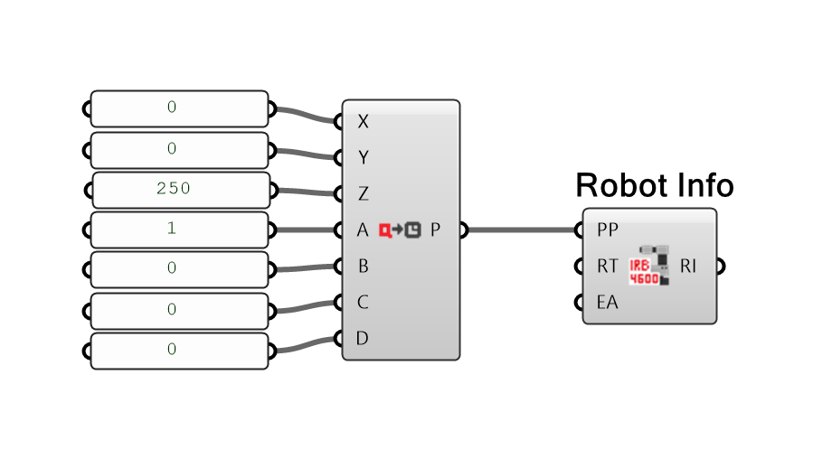
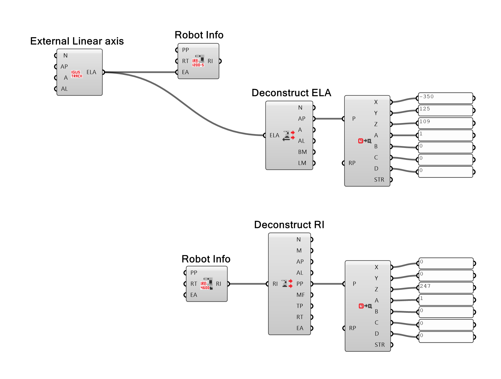

# Robot Components EDEK Presets

This repository contains the preset components of the robots and external axes of [EDEK Uni Kassel](https://edek.uni-kassel.de/). The preset components are made for the Rhinoceros Grasshopper plugin [Robot Components]( https://github.com/EDEK-UniKassel/RobotComponents). The presets are compiled in one separate grasshopper plugin (.gha file) that is build on top Robot Components. Installation of Robot Components is required to be able to work with the defined presets.

## Getting started
The installation is the same as for Robot Components. Download the latest release with presets directly from this repository's [release page](https://github.com/EDEK-UniKassel/RobotComponents-EDEK-Presets/releases). Download and place the `RobotoComponentEDEK.gha` file in the Grasshopper Components folder (in GH, File > Special Folders > Components Folder). Make sure that all the files are unblocked (right-click on the file and select `properties` from the menu. Click `unblock` on the `general` tab). Restart Rhino and you are ready to go! Under the Robot Components tab an additional category should be available with the preset components. Please read the information below for a detailed explanation on how to use the presets.

## Getting and checking position data
The position data of the external axes and the robots have to match with the data as defined in your Grasshopper file, the data in the (virtual or physical) controller and the physical setup. In this section it is explained how to get the position data from the controller in Robot Studio and how to use this data inside Grasshopper. The defined presets (especially the external linear axes) should already match with the position as how they defined in the physical controller, however, the user should always check this before using the physical setup. There is  one other important note and rule you have to know before you work with the physical controller:

***Guests and students are not allowed to change the position frames of the robots and external axes in the physical controller without permission of the EDEK staff members.***

Wants connected to a virtual or physical controller you can look up the robot and external axis positions as follows in Robot Studio:

- Robot positions: Go to the tab `Controller`. Select in the left menu the tab `Configuration`. Go to `Motion`. From the `Type` list you have to select `Robot`. Here you can look up the position data of the robot(s). Check [this figure](https://github.com/EDEK-UniKassel/RobotComponents-EDEK-Presets/blob/master/Utility/Figures/Robot_studio_robot_position.png) for a visual explanation. 

- External axis positions: Go to the tab `Controller`. Select in the left menu the tab `Configuration`. Go to `Motion`. From the Type list you have to select `Single`. Here you can look up the position data of the external axes. Check [this figure](https://github.com/EDEK-UniKassel/RobotComponents-EDEK-Presets/blob/master/Utility/Figures/Robot_studio_external_axis_position.png) for a visual explanation.

The position and its orientation are given as coordinates (`Base Frame x`, `Base Frame y` and `Base Frame z`) and quaternion values (`Base Frame q1`, `Base Frame q2`, `Base Frame q3`, `Base Frame q4`).  In grasshopper these values can be converted to a plane by using the [Quaternion to Plane](https://edek-unikassel.github.io/RobotComponents-Documentation/docs/Robot%20Components/Utility/Quaternion%20to%20Plane/) component. A simple example is given below.

To check if an already defined robot or external axis is matching the position as defined in the physical or virtual controller the robot or external axis can be deconstructed with one of deconstruct components ([this](https://edek-unikassel.github.io/RobotComponents-Documentation/docs/Robot%20Components/Deconstruct/Definitions/Deconstruct%20Robot%20Info/), [this](https://edek-unikassel.github.io/RobotComponents-Documentation/docs/Robot%20Components/Deconstruct/Definitions/Deconstruct%20External%20Linear%20Axis/) or [this](https://edek-unikassel.github.io/RobotComponents-Documentation/docs/Robot%20Components/Deconstruct/Definitions/Deconstruct%20External%20Rotational%20Axis/) component). The position or axis plane can be converted to quaternion values by using the [Plane to Quaternion](https://edek-unikassel.github.io/RobotComponents-Documentation/docs/Robot%20Components/Utility/Plane%20to%20Quarternion/) component. Examples are given in the figure below.

## World coordinate space in Brandthaus
TODO

Where is zero? 
What is the position of the external linear axis? 

## Defining the position of work piece positioners (external rotational axes)
TODO

The x-axis of the axis plane is always facing upwards. 
The z-axis of the axis plane is always going from the center at the start to the center at the end. 
The y-axis follows from this principal. 
